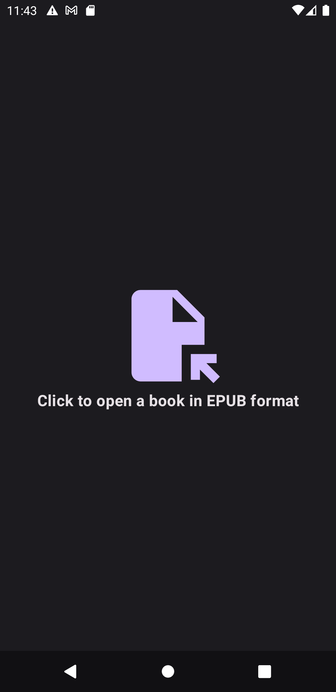

# No Ads EPUB Reader
Created this because I was sick of all the forced interstitial ads from the free EBook readers. Don't get me wrong, there are ad-free FOSS EPUB readers on F-Droid but I didn't like the UI/UX from the few that I've tried. They either look really dated or it was a pain trying to import an EPUB due to their custom file picker implementation which had a lacking UX.

# Features
Very minimal at this stage. Plan to add more in the future.

Currently, you can:
- [X] Import an EPUB.
- [X] Read an EPUB. Note - Only text elements are being parsed at the moment so if the EPUB has an image, it won't get displayed.
- [X] Search text in the opened EPUB.
- [X] Persist last opened EPUB file path and scroll position so you can get back reading to where you last left off.

Planned Features:
- [ ] Make importing EPUB quicker
- [ ] Potentially cache all the content for imported EPUBs for quicker loading
- [ ] Table of contents navigation
- [ ] Reading progress indicators
- [ ] Bookmarking
- [ ] Change font
- [ ] Change font size
- [ ] Parse other non-Text elements such as Images in the EPUB.

# Screenshots

